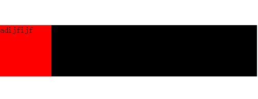
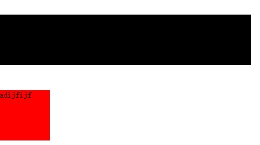
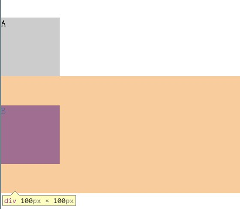
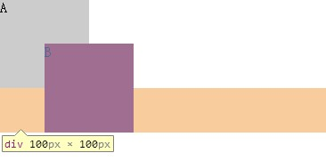
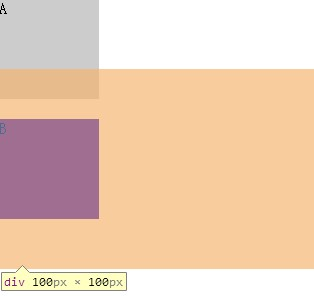
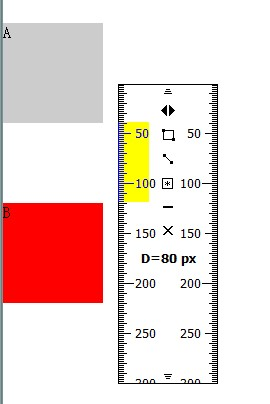
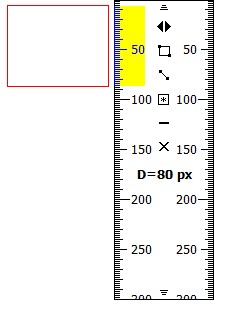

=============

##Collapsing margins

某些相邻的margins会合并为一个单个的margin，这被称之为折叠（collapse）

官方介绍：两个或多个毗邻（父子元素或兄弟元素）的普通流中的块元素在垂直方向上的margin会发生折叠。这种方式产生的外边距称为外边距叠加（Collapsing margins）

需要强调的几点：

1.两个或多个

数量必须大于一个，叠加是元素间的相互行为

2.毗邻的含义

如果某些margins没有被非空内容，padding，border或空白分隔彼此，那么我们说这些margins是相邻的，同时这些margin都处于普通流（非浮动元素，非定位元素）中 

到底在哪种情况下才能说某些个元素是毗邻的？

* 一个元素的margin-top和它的第一个子元素的margin-top
* 普通流中一个元素的margin-bottom和它紧邻的兄弟元素的margin-top
* 一个height为auto的元素的margin-bottom和它最后一个子元素的margin-bottom
* 一个没有创建BFC，没有子元素，height为0或auto的元素自身的margin-top和margin-bottom

满足上述条件后再结合毗邻的第一段话即：元素间没有被非空内容，padding，border或空白分隔开，则满足毗邻条件

3.垂直方向

只有垂直方向的margin才会叠加，水平方向的margin不会发生叠加

4.普通流
注意是在普通流中，普通流的含义在CSS box model文章中有介绍

####发生margin叠加

两种情况下发生：1.父子元素  2.兄弟元素

举个栗子

	

	    
      
	        
green
      
	    

	

效果图

<figure>
	
</figure>

我们可以看到父元素和子元素发生了叠加，本来父元素的margin为50px，叠加后变成了100px

在看兄弟元素的情况

	

	
adijfijf

效果图

<figure>
	
</figure>

两个相邻的兄弟元素，上面元素的margin-bottom为30px，下面元素的margin-top为50px，若不发生折叠，两者应该相距80px，然而两者垂直方向上的margin却为50px，说明发生了折叠

官方总结的一些rules：

* 只有块级的盒子的margin才会有重叠的可能
* 浮动的盒子的margin不会与其他任何margin产生重叠
* overflow不是visible的盒子与自己子元素的margin不会重叠
* 绝对定位的盒子不会与其他元素的margin产生重叠
* inline-block的盒子不会与其他盒子产生margin重叠
* 根元素的margin不会重叠
* 如果一个盒子已经出现重叠现象，这时对重叠的margin的某个方向（top,right,left）加间隔（clearance），那么相应方向的margin将不再和其父元素的bottom,left,right margin重叠

总结下两种情况父子元素和兄弟元素发生margin折叠的条件：

1.父子元素

* 父元素和第一个子元素发生margin-top叠加
	* 父元素不是BFC
	* 父元素和第一个子元素之间没有非空内容
	* 父元素没有border-top和padding-top

* 父元素和最后一个子元素发生margin-bottom叠加
	* 父元素不是BFC
	* 父元素的height为auto，min-height为0
	* 父元素与最后一个子元素之前没有非空内容
	* 父元素没有border-bottom和padding-bottom

2.兄弟元素

* 都不是float元素
* 都不是absolute元素
* 都不是inline-block元素

####margin折叠后的该如何计算？

1.折叠的margin都是正数

	
A

	
B

<figure>
	
</figure>

折叠后margin为50px,即margin都是正数时，取margin较大的值为最终值

2.折叠的margin都是负数

	
A

	
B

<figure>
	
</figure>

取绝对值较大的那个，即-50px，然后从0位置开始负向移位，A,B直接的margin为50px

3.折叠的margin有正有负

	
A

	
B

<figure>
	
</figure>

分别取出负margin中绝对值最大的和正margin中最大的相加。此处为50+（-30）=20px

4.多个相邻的margin折叠要一起参与运算，不能分步运算

	

		

			
A

		

	

	

		

		    
B

		

	

<figure>
	
</figure>

栗子中是6个相邻的margin折叠，将这6个值按正负分成两组

正：50px,150px,200px

负：-60px,-100px,-120px

正数的最大值为200px，负数的绝对值最大值为-120px，则最终折叠的margin为200+（-120）=80px

####元素自身的margin-bottom和margin-top毗邻时会折叠

此处需要栗子帮助理解

自身内容为空，垂直方向上border,padding为0

	

    	

	

效果图

<figure>
	
</figure>

得到的是宽为100px，高为80px（而不是150）的矩形，这是由于出现了边界折叠
