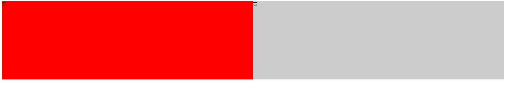

==========

##float,position布局

####用float和position的方法来实现一个两栏布局，左右均50%宽度，自适应浏览器宽度

1.float方法

HTML

	
左

	
右

CSS

	#div1{
			float: left;
			width: 50%;
			height: 300px;
			background: red;
		}

	#div2{
			overflow: hidden;
			height: 300px;
			background: #ccc;
			zoom:1;
		}

效果图

<figure>
	
</figure>

2.position方法

HTML

	

		
左

		
右

	

CSS

	#div3{
			position: relative;
	}

	#div1{
			position: absolute;
			left: 0;
			width: 50%;
			height: 300px;
			background: red;
	}

	#div2{
			position: absolute;
			right: 0;
			width: 50%;
			height: 300px;
			background: #ccc;
	}

效果图同上

####分别用float和position的方法来实现一个两栏布局，左侧定宽 300px，右侧自适应浏览器宽度

1.float方法

HTML

	
左

	
右

CSS

	#div1{
			float: left;
			width: 300px;
			height: 300px;
			background: red;
		}

	#div2{
			overflow: hidden;
			height: 300px;
			background: #ccc;
			zoom:1;
		}

效果图

<figure>
	
</figure>

2.position方法

HTML

	

		
左

		
右

	

CSS

	#div3{
			position: relative;
	}

	#div1{
			position: absolute;
			left: 0;
			width: 300px;
			height: 300px;
			background: red;
	}

	#div2{
			margin-left: 300px;
			height: 300px;
			background: #ccc;
	}

效果图同上

####分别用float和position的方法来实现一个两栏布局，右侧定宽 300px，左侧自适应浏览器宽度

1.float方法

HTML

	
右

	
左

CSS

	#div1{
			float: right;
			width: 300px;
			height: 300px;
			background: red;
		}

	#div2{
			overflow: hidden;
			height: 300px;
			background: #ccc;
			zoom:1;
		}

效果图

<figure>
	
</figure>

2.position方法

HTML

	

		
右

		
左

	

CSS

	#div3{
			position: relative;
	}

	#div1{
			position: absolute;
			right: 0;
			width: 300px;
			height: 300px;
			background: red;
	}

	#div2{
			margin-right: 300px;
			height: 300px;
			background: #ccc;
	}

效果图同上

####分别用float和position的方法来实现一个三栏布局，左侧定宽 200px，右侧定宽 200px，中间自适应浏览器宽度

1.float方法

HTML

	
左

	
右

	
中

CSS

	#div1{
			float: left ;
			width: 200px;
			height: 300px;
			background: red;
	}

	#div2{
			overflow: hidden;
			height: 300px;
			background: #ccc;
			zoom:1;
	}
	#div3{
			float: right;
			width: 200px;
			height: 300px;
			background: gold;
	}

效果图

<figure>
	
</figure>

2.position方法

HTML

	

		
左
	
		
中
		
		
右

	

CSS

	#div3{
			position: relative;
	}

	#div1{
			position: absolute;
			top: 0;
			left: 0;
			width: 300px;
			height: 300px;
			background: red;
	}

	#div2{
			margin:0 300px;
			height: 300px;
			background: #ccc;
	}

	#div4{
			position: absolute;
			top: 0;
			right: 0;
			width: 300px;
			height: 300px;
			background: gold;
	}

效果图同上

####分别用float和position的方法来实现一个布局，最外层容器居中，宽度为80%，这个容器中分三行，最上方一行是左右两栏，高100px，左侧100px宽。中间行为20个DOM，每个高30px，宽100px，外边距10px，均向左浮动，最下一行为一个和外层容器等宽，高100px的DOM

1.float方法

HTML

		

			

				

				

			

			

				

				

				

				

				

				

				

				

				

				

				

				

				

				

				

				

				

				

				

				

			

			

		

CSS

		#wrap{
			width: 80%;
			margin:0 auto;
			background: #ccc;
		}

		#div1_left{
			float: left ;
			width: 100px;
			height: 100px;
			background: red;
		}
		#div1_right{
			overflow: hidden;
			height: 100px;
			background: #666;
			zoom:1;
		}

		#div2_element{
			float: left;
			width: 30px;
			height: 30px;
			margin: 10px;
			background: pink;
		}
		#div3{
			clear: both;
			width: 100%;
			height: 100px;
			background: gold;
		}

效果图

<figure>
	
</figure>

2.position方法

HTML同上

CSS

		#wrap{
			width: 80%;
			margin:0 auto;
			background: #ccc;
			position: relative;
		}

		#div1_left{
			position: absolute;
			top: 0;
			left: 0;
			width: 100px;
			height: 100px;
			background: red;
		}

		#div1_right{
			margin-left:100px;
			height: 100px;
			background: #666;
		}

		#div2_element{
			float: left;
			width: 30px;
			height: 30px;
			margin: 10px;
			background: pink;
		}
		#div3{
			clear: both;
			width: 100%;
			height: 100px;
			background: gold;
		}

效果图同上